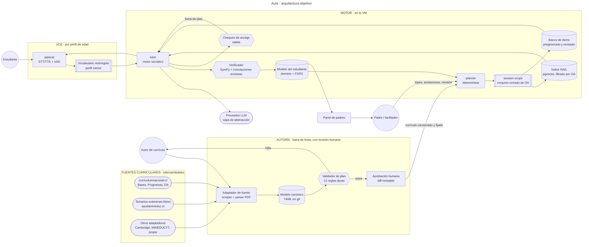

# Aula · Sistema de tutoría con IA para educación en casa

**Versión 1 (2026-09-07)** · Primer documento de diseño. **Nada construido todavía.**

Sistema de tutoría personalizada para dos hijos (7 y 13 años) educados en casa en Chile. Un tutor
conversacional por voz, anclado al currículo nacional chileno, que enseña con método socrático y
aprendizaje para el dominio, y que le reporta al padre dónde poner su hora de atención.

> **Cómo leer este documento.** Empieza por el [journey del estudiante](#1-journey-del-estudiante):
> es la lente que ordena todo lo demás. El [modelo pedagógico](#3-el-modelo-pedagógico) contiene la
> revisión honesta de tu resumen del piloto salvadoreño — qué adopto tal cual y qué corrijo, con la
> razón de cada cambio. Las decisiones que más condicionan el sistema no son de arquitectura sino de
> tres hallazgos de investigación ([§0](#0-los-tres-hallazgos-que-condicionan-todo)). Si solo vas a
> leer dos secciones, que sean esas dos.

### Cómo leer las marcas de estado

Este proyecto todavía no tiene código, así que la marca no dice «implementado» sino **qué tan firme
es la afirmación**. En un diseño construido sobre investigación web, esa es la distinción que
importa.

| Marca | Significa |
| --- | --- |
| ✅ | **Verificado** contra fuente primaria o de alta confianza, con URL |
| 🔵 | **Decisión de diseño** tomada en esta versión |
| ⚠️ | **Pendiente**: decisión abierta, o dato que **debes verificar tú** antes de actuar |
| ⛔ | **Bloqueado por un tercero** — depende de alguien fuera de este proyecto |

> **Advertencia metodológica que aplica a todo el documento.** Buena parte de la investigación se
> hizo con el acceso directo a sitios oficiales bloqueado por el proxy de red: `mineduc.cl`,
> `ayudamineduc.cl`, `chileatiende.gob.cl`, `cloud.google.com` y las páginas de precios de OpenAI,
> Anthropic y Google no se pudieron leer palabra por palabra. Las URLs son reales y salieron de
> resultados de búsqueda, pero **las fechas, montos y requisitos marcados ⚠️ hay que reconfirmarlos
> en la fuente antes de actuar**. No inventé ninguna URL.

## Estado del proyecto

Diez módulos, ninguno construido. Lo que decide el orden no es la dificultad técnica sino el riesgo:
hay dos supuestos que, si son falsos, cambian el diseño entero, y conviene probarlos antes de
escribir la parte cara.

| Módulo | Estado | Riesgo que lo bloquea |
| --- | --- | --- |
| `curriculum` — adaptadores, modelo canónico, **validador** | 🔵 diseñado | Estado normativo del currículo chileno ⚠️ |
| `grounding` — RAG filtrado + chequeo de anclaje | 🔵 diseñado | Ninguno técnico; hay que medir el costo por turno |
| `student` — dominio + repaso espaciado (FSRS) | 🔵 diseñado | Ninguno; es código conocido |
| `planner` — planificador determinista + `session_scope` | 🔵 diseñado | Ninguno |
| `tutor` — motor socrático + contrato de herramientas | 🔵 diseñado | Que la pedagogía funcione con tus hijos ⚠️ |
| `assess` — SymPy + concepciones erróneas + rúbricas | 🔵 diseñado | Cobertura de la biblioteca de errores típicos |
| `voice` — voz por perfil de edad | ⚠️ **el mayor riesgo técnico** | **El ASR con un niño de 7 años** ([§0.1](#01-el-reconocimiento-de-voz-falla-mucho-con-un-niño-de-7-años)) |
| `parent` — panel, reportes, topes, portafolio | 🔵 diseñado | Ninguno |
| `content` — material, narración, video programático | 🔵 diseñado | Ninguno |
| `web` — PWA, dos pieles de UI | 🔵 diseñado | Ninguno |

**Los bloqueantes reales**, en orden de consecuencia:

1. ⚠️ **El estado normativo del currículo chileno.** El CNED **rechazó dos veces** la actualización
   de las Bases Curriculares 1° básico–2° medio, y no está claro si en 2026 rige la Priorización
   Curricular extendida o una versión nueva. Además la estructura 8+4 pasa a **6+6 en 2027**.
   Consecuencia: el currículo **debe ser un dato versionado y fijado por estudiante**, nunca código.
   **Verificar en [curriculumnacional.cl/actualizacion-curricular](https://www.curriculumnacional.cl/actualizacion-curricular)
   antes de escribir el adaptador.** ([§4.1](#41-el-requisito-que-cambia-la-arquitectura-))
2. ⚠️ **El reconocimiento de voz con un niño de 7 años.** WER del ~40% documentado. Todo el diseño
   de voz del perfil menor existe para esquivar esto, y **hay que medirlo con tu hijo real** antes
   de construir encima. ([§7](#7-diseño-de-voz-por-edad))
3. ⚠️ **Los términos de uso de los proveedores de IA respecto a menores.** Anthropic exige 18+;
   la API de Google prohíbe servicios dirigidos a menores; OpenAI sí documenta una vía con permiso
   parental. Decide el proveedor por contrato, no por calidad. ([§9.2](#92-el-problema-de-los-términos-de-uso))
4. ⚠️ **Las licencias del material del MINEDUC son por recurso**, no uniformes: conviven CC BY-SA y
   «todos los derechos reservados». Determina si el proyecto puede distribuirse con contenido o solo
   con el importador. ([§5.5](#55-licencias-el-punto-que-decide-cómo-se-distribuye))
5. ⚠️ **¿Puede tu hijo de 7 años rendir exámenes libres?** Aparece una restricción —no confirmada—
   de que los menores de 15 años solo rinden «en casos justificados evaluados por la SECREDUC».
   Afecta el calendario de acreditación del menor, no el diseño del software.
   ([§10.2](#102-la-restricción-de-edad-que-hay-que-confirmar))
6. ⚠️ **El STT en 2 vCPU puede quedarse corto para el perfil menor.** El VPS Hostinger KVM 2 tiene
   RAM de sobra pero **2 vCPU**, y Whisper añade ~1.5-3 s de latencia ahí — por encima del objetivo
   de <1.5 s para el niño de 7. No bloquea nada mientras el sistema corra en el Mac en casa.
   ([§8.2](#82-qué-aguanta-cada-máquina))

**El costo estimado es de $0 a $8/mes** ([§8.3](#83-los-costos-por-etapa)): $0 durante el desarrollo
en el Mac con Ollama, y **$2-8/mes** cuando el tutor pase a una API en las sesiones reales. Todo
corre primero en local; el VPS de Hostinger que ya pagas absorbe la producción **sin costo
incremental**, porque incluye 8 TB de tráfico. El egress de audio, que era la preocupación inicial,
resulta ser el 0,04% de esa cuota.

## Índice

0. [Los tres hallazgos que condicionan todo](#0-los-tres-hallazgos-que-condicionan-todo)
1. [Journey del estudiante](#1-journey-del-estudiante)
2. [Journey del padre facilitador](#2-journey-del-padre-facilitador)
3. [El modelo pedagógico](#3-el-modelo-pedagógico)
4. [Visión general del ecosistema](#4-visión-general-del-ecosistema)
5. [Componentes del sistema](#5-componentes-del-sistema)
6. [La fuente curricular](#6-la-fuente-curricular)
7. [Diseño de voz por edad](#7-diseño-de-voz-por-edad)
8. [Infraestructura y costos](#8-infraestructura-y-costos)
9. [Seguridad, privacidad y menores](#9-seguridad-privacidad-y-menores)
10. [Acreditación: exámenes libres](#10-acreditación-exámenes-libres)
11. [Diseño visual](#11-diseño-visual)
12. [Plan de construcción](#12-plan-de-construcción)
13. [Temas por resolver](#13-temas-por-resolver)
14. [Verificación](#14-verificación)
15. [Glosario](#15-glosario)

---

## 0. Los tres hallazgos que condicionan todo

Antes de la arquitectura. Estos tres hallazgos cambian decisiones de raíz, y dos de ellos van contra
la intuición.

### 0.0 Sobre la noticia de El Salvador: qué dice realmente ✅

Tenías razón en que es reciente — es del **5 de septiembre de 2026**, dos días antes de escribir
esto. Los números finos importan:

- Bukele anunció que escuelas públicas con tutores de IA obtuvieron resultados comparables a los
  promedios de **Alemania y Suecia en PISA 2022**.
  ([Infobae](https://www.infobae.com/el-salvador/2026/09/05/nayib-bukele-asegura-que-escuelas-con-tutores-de-ia-alcanzaron-el-nivel-educativo-de-alemania-y-suecia/))
- Fue un **piloto de 171 escuelas** con **1,198 estudiantes voluntarios**, medido con **PISA for
  Schools** (herramienta distinta del PISA nacional), durante poco más de un año.
- **El Banco Mundial, que financia el programa, aclaró explícitamente que no representa al sistema
  educativo salvadoreño.**
  ([La Noticia SV](https://lanoticiasv.com/banco-mundial-ve-avance-en-la-educacion-salvadorena-tras-primera-prueba-pisa-for-schools-resultados-son-comparables-con-alemania-y-suecia/))
- El dato nacional real: **PISA 2022, puesto 143 de 147**; matemáticas 343 pts vs. 472 de la OCDE.
  Los resultados de **PISA 2025 se publicaban el 8-sep-2026** — vale la pena mirarlos.
- Contexto: acuerdo con **xAI/Grok** (dic-2025) para tutor nacional, y el programa **AprendES** del
  Banco Mundial (**USD 501 millones**, 2026-2031).

**Qué significa para nosotros.** Hay sesgo de selección (escuelas ya modernizadas), autoselección
(voluntarios) y comparación cruzada de años. No existe todavía un «modelo salvadoreño con IA»
validado que copiar. Pero tu resumen de la metodología **sí describe correctamente** los mecanismos
que usaron (ITS + mastery learning), y esos sí tienen respaldo independiente. Así que copiamos **la
metodología, no el titular** — que es exactamente lo que propusiste.

### 0.1 El reconocimiento de voz falla mucho con un niño de 7 años ✅

El hallazgo técnico más importante y el más contraintuitivo.

- **WER en habla infantil leída ≈ 40%**, frente a **<2% en adultos** con los modelos actuales de
  2026. En aula con ruido llega al 78% de error.
  ([arXiv 2502.08587](https://arxiv.org/abs/2502.08587),
  [ScienceDirect](https://www.sciencedirect.com/science/article/pii/S0885230825000841))
- Causas: tracto vocal más pequeño (formantes más altos y variables), pronunciación en desarrollo,
  vocabulario limitado. **El error crece con la longitud del audio.**
- Con 13 años el problema es mucho menor (voz cercana a la adulta).
- No existen benchmarks públicos de niños **hispanohablantes** de 7 años. Es un hueco real de la
  industria: nadie puede decirte el número exacto para tu hijo.

🔵 **Consecuencia**: «conversación libre por voz» con el menor no funciona y no es cuestión de
presupuesto. El diseño trata los dos perfiles como **dos productos distintos** ([§7](#7-diseño-de-voz-por-edad)).
Y tu **principio del lápiz y papel** resuelve buena parte del problema de rebote — por eso lo subo a
principio de arquitectura, no de sesión.

### 0.2 La ganancia real de un tutor de IA es modesta, no mágica ✅

- El ideal teórico de **Bloom (1984)** es **2 desviaciones estándar** para tutoría 1:1 con mastery
  learning. ([Bloom, *Educational Researcher*](https://journals.sagepub.com/doi/10.3102/0013189X013006004))
- Lo **medido** con Khanmigo en un experimento de dos años: **0.06–0.08 DE por año**, hasta
  **0.14 DE** con participación activa completa.
  ([EdWorkingPapers](https://edworkingpapers.com/sites/default/files/ai26-1551.pdf))
- **Alucinaciones en matemáticas**: incluso con auto-consistencia, el error baja de 29% a 13% — más
  de 1 de cada 10 respuestas sigue mal.
  ([Hechinger Report](https://hechingerreport.org/proof-points-combat-ai-hallucinations-math/))

🔵 **Tres consecuencias**: (a) el LLM **nunca** es la autoridad en matemáticas — verificación
simbólica determinista; (b) lo que produce las 2 sigma es **mastery learning + tú involucrado**, no
el chatbot, así que el panel del padre es crítico y no decorativo; (c) las expectativas se calibran
en «mejor que una sala de 35 alumnos», no en «genio en seis meses».

### 0.3 En Chile la educación en casa es legal, y eso simplifica mucho ✅

Contrario a El Salvador —donde el homeschool **no** está reconocido como modalidad—, en Chile:

- **Es legal.** Se apoya en el **derecho preferente y deber de los padres a educar a sus hijos**
  (Constitución art. 19 N°10; **LGE Ley 20.370, art. 4°**). No hay ley que lo prohíba ni que lo
  regule como institución aparte. Un estudio de la UDD (2025) concluye que *«en Chile no hay
  obstáculos legales para practicar el homeschooling»*.
  ([estudio UDD](https://educacion.udd.cl/files/2025/06/homeschooling-y-exclusion.pdf))
- **Lo obligatorio es la educación, no la asistencia** a un establecimiento.
- Existe una vía oficial y **gratuita** de certificación: los **exámenes libres** del MINEDUC
  (**Decreto Exento 2272/2007**, ⚠️ modificado por el **Decreto 708 de julio de 2024**, cuyo
  contenido no pude verificar). ([BCN](https://www.bcn.cl/leychile/Navegar?idNorma=267943))
- **Y lo más útil para el diseño**: el MINEDUC publica **temarios oficiales por curso**, basados en
  los **Objetivos de Aprendizaje (OA)** de las Bases Curriculares. Son un **subconjunto curado** del
  currículo completo.
  ([temario 2° básico](https://ayudamineduc.cl/sites/default/files/temario_basica_2deg_basico_uce_0.pdf),
  [temario 7° básico](https://ayudamineduc.cl/sites/default/files/temario_basica_7deg_basico_uce_0.pdf))
- El fenómeno creció de **7.592 inscripciones (2013) a 33.331 (2023)**.
  ([Kilómetro Cero](https://kilometrocero.cl/aprender-en-casa-el-creciente-fenomeno-del-homeschooling-en-chile/))

🔵 **Consecuencia de diseño, y es grande**: el sistema tiene un **blanco oficial, público y
acotado**. No hay que adivinar qué enseñar ni cómo evaluar: el temario del curso es la meta mínima
y las Bases Curriculares son el territorio completo. El sistema apunta a **dominar el temario con
holgura y seguir bastante más allá**.

Detalle importante: **la ley chilena no exige portafolio ni registro de horas** — el único requisito
es aprobar el examen. Dijiste que la acreditación no te preocupa por ahora, y eso encaja: el
registro de evidencias queda como herramienta **pedagógica** tuya, no como obligación legal.

---

## 1. Journey del estudiante

### 1.1 Las dos personas

No es un producto con dos tamaños de letra. Son **dos productos que comparten motor**.

> **El menor · 7 años, 2° básico.** Lee de corrido pero se cansa; escribe lento. Su atención sostenida
> real son 15-20 minutos, no 35. Se frustra rápido cuando algo no le entiende —y el reconocimiento
> de voz *va* a no entenderle—. Aprende manipulando, dibujando y hablando, no leyendo instrucciones.
> Necesita saber que va bien más seguido de lo que un adulto necesita.

> **El mayor · 13 años, 7° u 8° básico.** Teclea rápido, lee bien, puede sostener 40 minutos. Ya
> detecta cuando lo tratan como niño chico y eso lo expulsa del producto en un minuto. Le motiva ver
> su propio progreso como datos y fijarse metas. Puede —y debe— trabajar solo tramos largos.

**Cinco restricciones que definen el diseño**, y la quinta es la que más consecuencias tiene:

* **El menor no puede dictarle al sistema.** Con ~40% de error de reconocimiento, cualquier flujo que
  dependa de transcribir su habla libre está roto de origen.
* **El mayor no tolera la infantilización.** Un mismo tema con mascota y confeti no funciona a los 13.
* **Ninguno de los dos tiene un profesor humano al lado todo el día.** Ese es el punto del proyecto,
  y también su mayor riesgo: si el sistema se atasca, no hay quien rescate en el momento.
* **La sesión compite con todo lo demás.** No hay campana ni compañeros; la única estructura es la
  que ponga el sistema y tú.
* **El trabajo real ocurre en papel, no en pantalla.** Es tu principio del lápiz y papel, y de él
  cuelga media arquitectura: el sistema ve el *razonamiento* y el *resultado*, no cada trazo.

### 1.2 Los dos modos de sesión

Conviene tratarlos como **dos productos distintos**, igual que tú tratabas los dos modelos de compra.

|  | **Modo Explorador (≈6-9)** | **Modo Taller (≈10-15)** |
| --- | --- | --- |
| Duración del bloque | **20-25 min** (5/12/5) 🔵 | **35-40 min** (5/20/10) ✅ tu propuesta |
| Voz | Salida principalmente; entrada restringida | Conversación abierta |
| Entrada del alumno | Tocar, arrastrar, número, dibujo, foto del cuaderno | Teclado, voz libre, LaTeX |
| Fase de Feynman | Le enseña al personaje **dibujando o eligiendo** 🔵 | Explica hablando o escribiendo ✅ |
| Progreso | Mapa de viaje ilustrado | Barras de dominio, rachas, metas propias |
| Tono | Cálido, personaje guía | Par de estudio, cero condescendencia |
| Riesgo principal | Frustración por no ser entendido | Aburrimiento y abandono |

**Por qué 20-25 min y no 35 para el menor** 🔵. Tu estructura de 35 minutos es correcta y está bien
fundada, pero está calibrada para el rango medio. A los 7 años la atención sostenida no da para 20
minutos seguidos de práctica socrática. La misma estructura de tres fases se mantiene —diagnóstico,
práctica, cierre—, comprimida y con más cambios de modalidad dentro. **Dos bloques de 20 rinden más
que uno de 40**, y además duplican el efecto de espaciamiento.

### 1.3 Mapa del journey de una sesión

Formato del mapa de journey de `tools.boche.cloud`, para que puedas pegarlo tal cual. `!` marca una
fricción y `*` un momento de verdad.

```journey
---
title: Journey de una sesión · Modo Taller (13 años)
---

| # | Fase | Etapa | Qué hace | Qué ve | Qué pasa en el sistema | Emoción | Riesgo y mitigación |
|---|---|---|---|---|---|---|---|
| 0 | Antes | Convocatoria | Abre la tablet o el laptop a la hora acordada | Su plan del día, 3 bloques, sin sorpresas | El planificador ya resolvió qué toca según dominio y repasos vencidos | = | !Si el plan cambia cada día pierde la sensación de control; el plan se fija la noche anterior |
| 1 | Calentamiento | Diagnóstico | Responde 3 preguntas cortas de dificultad creciente | Tres tarjetas, sin cronómetro | Se estima el punto de partida real de hoy, no el de la última sesión | = | *Si las 3 salen bien, saltar la introducción; si no, ubicar el concepto exacto |
| 2 | | Ubicación | Ve dónde quedó y qué sigue | Una frase: hoy seguimos con X | Se carga el OA objetivo y sus prerrequisitos | + | Sin esto la sesión se siente aleatoria |
| 3 | Práctica | Primer problema | Lo resuelve en el cuaderno | Enunciado y un campo para su razonamiento | Nada se evalúa hasta que él lo diga | + | !El sistema no ve el cuaderno; solo ve lo que él escribe |
| 4 | | Se atasca | Dice que no sabe cómo seguir | El tutor pregunta, no resuelve | Micro-pista nivel 1; se registra el intento | - | *!Aquí se gana o se pierde: si el tutor resuelve, el alumno aprende a pedir la respuesta |
| 5 | | Tercer bloqueo | Sigue sin poder | Aparece un ejercicio análogo más simple | Se baja al prerrequisito y se marca la brecha | = | El ejercicio análogo nunca es el mismo problema con otros números |
| 6 | | Lo resuelve | Escribe su respuesta | Verificación inmediata | SymPy verifica; no el modelo | ++ | *La verificación es determinista: cero riesgo de decirle mal a un niño que está bien |
| 7 | | Repite | Dos o tres problemas más, intercalados | Dificultad que sube sola | Se mezclan tipos, no se agrupan en bloque | + | El intercalado se siente más difícil y enseña más |
| 8 | Cierre | Feynman | Explica con sus palabras por qué funciona | Ahora tú eres el profesor | Se evalúa la explicación con rúbrica, no la respuesta | ++ | *Aquí se distingue memorizar de entender |
| 9 | | Bitácora | Ve qué dominó hoy y qué queda pendiente | Dos líneas, sin nota numérica | Se actualiza el estado de dominio y se agenda el repaso | + | !Una nota numérica diaria convierte todo en persecución de puntaje |
| 10 | Después | Repaso agendado | En 2 días vuelve a ver ese concepto | Una pregunta suelta al inicio de otra sesión | FSRS decide cuándo, no el calendario | = | *Sin esto, lo de marzo se evaporó en octubre |
| 11 | | Reporte al padre | No hace nada | Nada, es para el padre | Se genera el resumen de la sesión | = | El reporte dice dónde poner tu hora, no cuánto rindió |
```

### 1.4 El principio del lápiz y papel 🔵

Lo propusiste como regla de interacción y lo elevo a **principio de arquitectura**, porque resuelve
tres problemas a la vez y ninguno es obvio:

1. **Esquiva el reconocimiento de voz.** El niño no tiene que dictar su procedimiento; escribe el
   resultado o el paso. Es la mitigación más barata del hallazgo [§0.1](#01-el-reconocimiento-de-voz-falla-mucho-con-un-niño-de-7-años).
2. **Preserva la carga cognitiva correcta.** Resolver en pantalla con un editor de fórmulas gasta
   atención en la herramienta en vez de en el problema.
3. **Genera la evidencia sin esfuerzo extra.** 🔵 Añado una vuelta de tuerca: **una foto del cuaderno
   con la cámara de la tablet** al cerrar el bloque. Cuesta cinco segundos, alimenta el portafolio, y
   te deja ver *cómo* piensa —que es más informativo que si acertó—.

### 1.5 Momentos de verdad y métricas

Los tres momentos que deciden si esto sirve:

1. **«El sistema me entendió»** (etapa 3-4, sobre todo en el menor) → métrica: *tasa de turnos de voz
   que requieren repetición*. Si es alta, el modo Explorador está roto y hay que replantear la
   entrada, no subir el presupuesto.
2. **«No me dio la respuesta, pero pude»** (etapa 4-6) → métrica: *proporción de problemas resueltos
   tras micro-pista frente a los abandonados o resueltos por el tutor*. Es la métrica central del
   proyecto: mide si el andamiaje funciona.
3. **«Lo sigo sabiendo un mes después»** (etapa 10) → métrica: *tasa de acierto en el primer repaso
   diferido*. Es la única que distingue aprendizaje de rendimiento del día.

Métricas de soporte: minutos efectivos por sesión, sesiones completadas frente a agendadas, latencia
hasta el primer audio, costo por sesión, cobertura del temario oficial, y **horas de adulto
registradas** ([§2](#2-journey-del-padre-facilitador)).

> Ninguna de estas existe hasta que se construya. La 2 y la 3 son las que hay que instrumentar
> desde la primera versión, aunque el panel sea feo.

---

## 2. Journey del padre facilitador

Tu resumen dice que tu rol es revisar el reporte. **Es cierto en un 80% y conviene marcar el 20%
restante**, porque es justo donde la evidencia dice que se gana o se pierde.

**Lo que el sistema te quita de encima** ✅ — y es mucho:
- No necesitas dominar la materia. El sistema explica, pregunta y verifica.
- No necesitas planificar. El planificador resuelve qué toca hoy y por qué.
- No necesitas corregir. La verificación es automática y determinista.

**Lo que no te puede quitar** ⚠️ — y donde tu resumen es un poco optimista:
- La investigación sobre homeschool es consistente en que **la estructura y las horas de adulto son
  el mayor predictor de resultados**, y que el homeschool poco estructurado correlaciona con peores
  resultados académicos y sociales.
  ([Kunzman & Gaither](http://icher.org/files/Kunzman_and_Gaither_An%20Updated_Comprehensive_Survey.pdf),
  [Psychology Today](https://www.psychologytoday.com/us/blog/parenting-translator/202109/the-research-homeschooling))
- La orientación práctica de la comunidad homeschool (⚠️ divulgativa, no revisada por pares) sugiere
  **1-2 h diarias de adulto en básica inicial y 2-3 h en tercer ciclo**.
- **No encontré ninguna investigación sobre cuánto de eso puede sustituir la IA.** Es un vacío real.
  Nadie sabe la respuesta todavía, y quien te diga lo contrario está vendiendo algo.
- Lagunas típicas documentadas del homeschool: **matemáticas, idiomas, artes y educación
  financiera**. 🔵 El planificador vigila explícitamente esas cuatro y te avisa.

🔵 **Consecuencia de diseño**: el planificador **agenda bloques «contigo»**, no solo sesiones con el
tutor, y el panel te muestra si esa cuota se está cumpliendo. El sistema no reemplaza tu hora: te
dice **dónde ponerla**. Esa es la diferencia entre liberar tiempo pedagógico y delegar la educación.

**Tu panel, en orden de importancia:**

| Qué ves | Para qué |
| --- | --- |
| **Alertas accionables** | *«Lleva 3 sesiones atascado en fracciones equivalentes — conviene que te sientes con él»* |
| **Transcripción completa de cada sesión** 🔵 | Seguridad. No negociable. Lo hablado y lo escrito, revisable |
| Mapa de dominio por asignatura | Ver huecos de un vistazo, no promedios |
| Cobertura del temario oficial | Cuánto falta para estar listo si decides rendir el examen |
| Horas de adulto registradas | La métrica que la evidencia dice que importa |
| Gasto del mes | Tope duro configurable |
| Portafolio y fotos del cuaderno | Ver *cómo* piensa, no solo si acertó |

---

## 3. El modelo pedagógico

Tu resumen es sólido y está bien fundado: los cuatro pilares que describes son efectivamente ITS +
mastery learning, y tienen respaldo independiente del piloto salvadoreño. Lo adopto casi entero.
Abajo, lo que tomo tal cual y las **siete correcciones** que propongo, cada una con su razón.

### 3.1 Lo que adopto sin cambios ✅

| Tu propuesta | Respaldo |
| --- | --- |
| **Alineación curricular estricta (grounding)** | Es lo correcto, y en Chile además hay temario oficial que lo hace exacto |
| **Método socrático y andamiaje** | Vygotsky (ZDP) operacionalizado por Wood, Bruner & Ross como *scaffolding* |
| **Aprendizaje para el dominio** | Bloom (1984) |
| **Estructura de bloques cerrados** con diagnóstico / práctica / cierre | Correcta; solo ajusto la duración para el menor |
| **Diagnóstico de 3 preguntas al inicio** | Evita explicar lo que ya sabe — la causa nº 1 de aburrimiento |
| **El principio del lápiz y papel** | Excelente; lo subo a principio de arquitectura ([§1.4](#14-el-principio-del-lápiz-y-papel-)) |
| **Prohibido dar respuestas directas** | El corazón del sistema |
| **Micro-pistas y ejercicio análogo más simple tras 3 bloqueos** | Es el *worked example effect* (Sweller) bien aplicado |
| **Prueba de Feynman** | Su nombre técnico es *self-explanation effect*, bien documentado (Chi et al.) |
| **Respuestas de 2-3 oraciones terminadas en pregunta** | Correcto; un tutor que escribe párrafos pierde al alumno |
| **Validar el esfuerzo, no la inteligencia** | Correcto y gratis. ⚠️ Matiz honesto: las réplicas grandes de intervenciones de mentalidad de crecimiento dan efectos pequeños (~0.05 DE). Se mantiene porque no cuesta nada y evita el daño del elogio a la habilidad, pero sin sobrevenderlo |
| **Consistencia sobre duración** (35 min × 3-4/sem) | Es el *spacing effect*. Bien visto |
| **Tu rol como facilitador** | Correcto, con el matiz de [§2](#2-journey-del-padre-facilitador) |

### 3.2 Las siete correcciones 🔵

**1. El 80% como criterio de dominio es estadísticamente frágil.**
80% sobre 5 ítems es 4 de 5, y el intervalo de confianza de eso va aproximadamente de 36% a 98%. Un
niño puede «dominar» por suerte y otro fallar por un descuido. Además, acertar hoy no dice nada
sobre recordar en octubre.
🔵 **Propuesta**: el 80% se mantiene como **umbral de avance dentro de la sesión**, pero el
**dominio** requiere acertar en **oportunidades separadas en el tiempo, incluyendo al menos una
diferida (≥1 día después)**. Es lo que predice retención.

**2. Falta el ciclo de repaso — es el hueco más grande del modelo.**
Los cuatro pilares no incluyen retención. Dominar no es recordar: sin repaso, lo de marzo se evaporó
para octubre, que es justo cuando se rinden los exámenes libres.
🔵 **Propuesta**: **FSRS** por encima del mastery learning. Supera a SM-2 en >99% de usuarios sobre
~700M de repasos. ([benchmark](https://expertium.github.io/Benchmark.html)) Cada sesión abre con 2-3
preguntas de repaso vencidas, integradas al calentamiento que ya propusiste. Coste: cero minutos
extra.

**3. El «diagnóstico de causa raíz del error» por LLM no es fiable en matemáticas.**
Pedirle al modelo que clasifique si el error fue de cálculo, concepto o lectura es justo el tipo de
juicio donde alucina, y con 13% de error residual documentado es demasiado.
🔵 **Propuesta**: **biblioteca determinista de concepciones erróneas**. Si responde 1/2 + 1/3 = 2/5,
eso es la concepción «sumo numeradores y denominadores», **detectable por regla**, no por
adivinanza. El LLM **explica** la concepción ya identificada; no la identifica. En asignaturas
abiertas (Lenguaje, Historia) sí se usa el LLM, pero con rúbrica explícita.

**4. La prueba de Feynman choca de frente con el ASR en el menor.**
Explicar oralmente con sus palabras es exactamente donde el reconocimiento falla al 40%. Es la mejor
idea del modelo aplicada donde peor funciona.
🔵 **Propuesta para el de 7 años**: que «le enseñe» al personaje **dibujando, arrastrando fichas o
eligiendo entre tres explicaciones (una correcta, dos con errores típicos)**. Y una variante que me
gusta más: **que lo explique en voz alta y el sistema no lo transcriba, sino que guarde el audio
para que lo escuches tú**. Conserva todo el valor pedagógico y elimina la dependencia del ASR.
Para el de 13, tu versión original funciona tal cual.

**5. La progresión bloqueada necesita una válvula de escape.**
Bloquear la *evaluación* de división de fracciones mientras no domine la suma, sí. Bloquear que el
niño *pregunte* por ella, no: es la única forma de matar la curiosidad, y la curiosidad es lo único
que no se puede reponer después.
🔵 **Propuesta**: el bloqueo aplica a **la progresión evaluada**, no a la conversación. Si pregunta,
el tutor responde breve, **registra el interés en la bitácora** y vuelve al plan. Especialmente
importante con el de 13.

**6. 35 minutos es demasiado para 7 años.**
🔵 **Propuesta**: 20-25 min para el menor (5/12/5), tu 35-40 para el mayor. Dos bloques cortos rinden
más que uno largo y además duplican el espaciamiento.

**7. Falta volumen de lectura y escritura sostenida.**
El modelo está muy orientado a resolución de problemas. A los 7 años **el volumen de lectura es el
mejor predictor** de casi todo lo demás; a los 13, la escritura extensa no cabe en bloques socráticos
de 35 minutos, y es justo lo que más se atrofia sin colegio.
🔵 **Propuesta**: dos tipos de sesión adicionales — **Lectura** (diaria, el sistema acompaña pero
**no interrumpe**; al final conversa sobre lo leído) y **Taller de escritura** (semanal, largo, con
revisión por rúbrica y varias versiones del mismo texto).

### 3.3 Los tipos de sesión resultantes 🔵

| Tipo | Duración | Frecuencia | Qué hace |
| --- | --- | --- | --- |
| **Núcleo** (tu estructura) | 20-25 / 35-40 min | 3-4 × semana por asignatura | Diagnóstico → práctica socrática → Feynman |
| **Repaso** | 5 min | Integrado al inicio de cada núcleo | Preguntas vencidas por FSRS |
| **Lectura** | 20-30 min | Diaria | Volumen; el sistema no interrumpe |
| **Taller de escritura** | 45-60 min | Semanal | Texto largo, rúbrica, versiones sucesivas |
| **Proyecto** | Variable | Quincenal | Aplicación práctica (sabor alemán) e indagación (sabor sueco) |
| **Contigo** | 30-60 min | Diaria | Bloque de adulto, agendado explícitamente |

### 3.4 Reglas del system prompt del tutor 🔵

Sobre las tuyas, que adopto, añado cuatro que salen de los hallazgos:

- **Nunca calcules.** Los resultados vienen del verificador. Si no tienes un resultado verificado,
  no afirmes que algo está bien o mal.
- **Frases cortas en el perfil menor.** El error de reconocimiento crece con la longitud del turno,
  también en la comprensión del niño.
- **Ante ambigüedad de audio, confirma.** *«Escuché ocho, ¿es eso?»* antes de evaluar. Nunca
  califiques como error algo que quizá no entendiste.
- **No cierres siempre con pregunta.** Tu regla de terminar en pregunta abierta es buena, pero al
  100% se siente interrogatorio. A veces toca reconocer y dejar respirar.

---

## 4. Visión general del ecosistema

### 4.1 El requisito que cambia la arquitectura 🔵

> *«Si bien estoy pensando en mis hijos debe servir para cualquier niño, debe poder tener un módulo
> para construir el plan de estudios bien validado y debe tener un mecanismo para no salirse de ese
> plan.»*

Esto convierte el proyecto de **una app familiar** en un **motor de tutoría currículo-agnóstico**.
Tres consecuencias, y ninguna es cosmética:

1. **El currículo deja de ser una constante y pasa a ser un dato de entrada versionado.** Chile es
   *un adaptador*, no *el* currículo. Y hay una razón práctica urgente para esto además de la
   generalidad: ⚠️ **el currículo chileno está en disputa ahora mismo** — el CNED rechazó **dos
   veces** la actualización de las Bases Curriculares 1° básico-2° medio por «objetivos ambiguos,
   progresiones poco claras y sobrecarga», y no está claro si en 2026 rige la Priorización
   Curricular extendida o una versión nueva.
   ([Emol, ago-2025](https://www.emol.com/noticias/Nacional/2025/08/27/1176153/ministerio-educacion-curriculum-colegios-2026.html))
   Encima, la estructura 8+4 cambia a **6+6 en 2027**.
   ([La Tercera](https://www.latercera.com/noticia/postergan-2027-cambio-divide-la-educacion-escolar-6-anos-basica-6-media/))
   Un sistema que hornee el currículo en el código queda obsoleto en un año.
2. **Hace falta un módulo de autoría y validación**, no solo de importación. Un plan de estudios
   «bien validado» es una afirmación verificable: grafo sin ciclos, sin objetivos huérfanos,
   cobertura demostrable, cada objetivo con evaluación y con trazabilidad a su fuente.
3. **El anclaje al plan tiene que ser una garantía del sistema, no una instrucción en el prompt.**
   Un *system prompt* que dice «no te salgas del currículo» es una sugerencia. Lo que propongo es
   una arquitectura donde **salirse sea imposible por construcción** ([§5.4](#54-anclaje-al-plan-grounding-en-cuatro-capas-)).

### 4.2 Diagrama

```
Diagrama · Arquitectura del ecosistema
Herramienta: Diagramas de arquitectura (pegar tal cual)
```



**Cinco decisiones de reparto de responsabilidades** 🔵:

1. **El planificador decide el tema, no el modelo.** El LLM nunca elige qué se estudia.
2. **El verificador decide si está bien, no el modelo.** SymPy y la biblioteca de concepciones
   erróneas son la autoridad; el LLM explica el veredicto.
3. **El currículo se construye solo; el humano interviene por excepción.** La IA importa, infiere y
   repara; el validador es su bucle de retroalimentación. Al padre solo le llega una cola corta de
   dudas, y puede resolverla mientras los niños ya usan el sistema
   ([§5.1](#el-plan-se-crea-solo--requisito-de-primer-orden-)).
4. **El currículo se fija por estudiante.** Si el MINEDUC publica una versión nueva a mitad de año,
   el niño sigue con la que empezó hasta que tú decidas migrar. Dado el estado de flujo del
   currículo chileno, esto no es teórico.
5. **El proveedor de LLM está detrás de una interfaz.** Lo exige [§9.2](#92-el-problema-de-los-términos-de-uso)
   y además permite cambiar sin reescribir.

---

## 5. Componentes del sistema

```
aula/
├─ curriculum/     Adaptadores, modelo canónico, validador, autoría
├─ grounding/      Índice RAG filtrado + chequeo de anclaje
├─ student/        Modelo de dominio + FSRS
├─ planner/        Planificador determinista + session scope
├─ tutor/          Motor socrático + herramientas
├─ assess/         Verificador SymPy + concepciones erróneas + rúbricas
├─ voice/          pipecat + perfiles por edad
├─ content/        Generación por lotes, narración, video programático
├─ parent/         Panel, reportes, topes, portafolio
└─ web/            PWA React (tablet + laptop)
```

### 5.1 `curriculum` — autoría y validación del plan 🔵

**El modelo canónico**, independiente del país:

```yaml
curriculum:
  id: cl-mineduc-2026
  fuente: { pais: CL, organismo: MINEDUC-UCE, version: "2026-03", url: ... }
  licencia: { tipo: por-recurso, revisado_por: carlos, fecha: ... }
  asignaturas:
    - id: MA
      niveles:
        - id: "05"
          objetivos:
            - codigo: MA05 OA 01
              texto: "Representar y describir números naturales de hasta más de 6 dígitos..."
              tipo: conocimiento          # conocimiento | habilidad | actitud (OAA)
              prioridad: nivel-1           # de la Priorización Curricular
              en_temario_examen: true      # ¿entra en el examen libre?
              prerequisitos: [MA04 OA 01]
              horas_estimadas: 6
              evidencia: [item_banco, explicacion_feynman]
              fuente: { doc: "Bases Curriculares 1-6", pagina: 214, url: ... }
```

**Los adaptadores de fuente.** El de Chile es el primero; la interfaz permite otros.

⚠️ **Hallazgo importante: no existe API ni dataset estructurado del currículo chileno.** El portal
`datos.mineduc.cl` sí tiene API REST con JSON y API key, pero sirve **datos administrativos**
(matrícula, establecimientos, docentes) — **no contenido curricular**. Los OA viven en páginas HTML
de `curriculumnacional.cl` y los Programas de Estudio en PDF. **Hay que hacer scraping y parseo.**

Dato revelador: el propio MINEDUC lanzó en 2026 una **herramienta de búsqueda semántica de OA con
IA** en su portal renovado — o sea, internamente sí tienen los OA en una base de datos con
embeddings, pero no la exponen.
([Subsecretaría de Educación](https://subeduc.mineduc.cl/curriculum-nacional-renueva-su-web-incluyendo-una-nueva-herramienta-de-apoyo-a-la-integracion-curricular/))
Confirma que el enfoque es correcto; solo hay que construirlo por fuera.

**Fuentes oficiales para el adaptador chileno** ✅ (usar solo dominios oficiales):

| Qué | Dónde | Formato |
| --- | --- | --- |
| Bases Curriculares 1°-6° (2012/2013) | [curriculumnacional.cl/614/w3-article-22394.html](https://www.curriculumnacional.cl/614/w3-article-22394.html) | HTML + PDF |
| Bases Curriculares 7°-2° medio (2015) | [PDF](https://media.mineduc.cl/wp-content/uploads/sites/28/2017/07/Bases-Curriculares-7%C2%BA-b%C3%A1sico-a-2%C2%BA-medio.pdf) | PDF |
| OA individuales | ej. [MA05 OA 01](https://www.curriculumnacional.cl/curriculum/1o-6o-basico/matematica/5-basico/ma05-oa-01) | HTML, una página por OA |
| Planes de Estudio (horas) | [Planes vigentes oct-2023](https://www.curriculumnacional.cl/614/articles-34970_recurso_plan.pdf), [7°-8° básico](https://www.curriculumnacional.cl/614/articles-34971_recurso_plan.pdf) | PDF |
| Programas de Estudio (unidades + indicadores) | [portal](https://www.curriculumnacional.cl/portal/Documentos-Curriculares/Planes-de-estudio/) | PDF por asignatura/curso |
| Temarios de exámenes libres | [2° básico](https://ayudamineduc.cl/sites/default/files/temario_basica_2deg_basico_uce_0.pdf), [7° básico](https://ayudamineduc.cl/sites/default/files/temario_basica_7deg_basico_uce_0.pdf) | PDF |
| Textos escolares | [curriculumnacional.cl/textos_escolares](https://www.curriculumnacional.cl/textos_escolares), [Aprendo en Línea](https://aprendoenlinea.mineduc.gob.cl/) | PDF |
| Priorización Curricular (Nivel 1 / Nivel 2) | [ficha](https://www.ayudamineduc.cl/ficha/priorizacion-curricular) | HTML/PDF |
| Estado de la actualización ⚠️ | [curriculumnacional.cl/actualizacion-curricular](https://www.curriculumnacional.cl/actualizacion-curricular) | **consultar antes de construir** |

⚠️ **Evitar sitios espejo no oficiales** (`mineduclibros.cl`, `librosdelministerio.cl`,
`textodelestudiante.cl`, `librosdelmineduc.cl` y varios más): imitan el nombre del MINEDUC, no son
dominios `.gob.cl`, y no se pudo verificar ni su legitimidad ni la fidelidad de su contenido.

**Codificación de los OA chilenos** ✅ (verificada para Matemática):
`MA` (asignatura, 2 letras) + `05` (nivel) + `OA` + `01` (número correlativo dentro del eje).
Los actitudinales usan `OAA` + letra: `MA05 OAA B`. ⚠️ Las siglas de otras asignaturas
(`LE`, `CN`, `HI`, `ING`) son plausibles pero no se verificaron con un ejemplo directo.

**Estructura de los Programas de Estudio** ✅: **4 unidades de 6 a 9 semanas**, cada una con un
subconjunto de OA, **indicadores de evaluación sugeridos**, actividades y orientaciones. Los
indicadores son *sugeridos*, no obligatorios — el sistema los usa como punto de partida y permite
sustituirlos.

#### El plan se crea solo — requisito de primer orden 🔵

> *«Necesito que desde el principio sea muy simple, que el plan se cree solo… si tengo que dedicarle
> un mes a hacer el plan no hay forma de ponerlo en marcha.»*

Tienes razón y esto corrige un error del diseño inicial, que ponía la revisión humana como **puerta**
de entrada. Una puerta así mata el proyecto antes de empezar. El principio correcto es
**automático por defecto, humano por excepción**:

```bash
aula curriculum import --pais CL --nivel 2 --asignatura todas
# 10-30 min desatendidos → plan usable + una lista corta de "revisa esto"
```

**El pipeline, sin intervención tuya:**

| Paso | Qué hace | Quién |
| --- | --- | --- |
| 1. **Descubrimiento** | Desde una URL raíz o `--pais CL --nivel 2`, encuentra los documentos: Bases, Programa, Plan de Estudio, temario | Crawler |
| 2. **Extracción** | HTML y PDF → objetivos estructurados, con doble pasada y auto-consistencia | IA |
| 3. **Enriquecimiento** | Infiere lo que el MINEDUC **no publica**: prerrequisitos entre OA, horas por objetivo, verbo de Bloom | IA |
| 4. **Generación de ítems** | Ejercicios, pistas escalonadas y análogos por objetivo (Batch API, 50% de descuento) | IA |
| 5. **Validación** | Las 12 reglas de abajo | Código |
| 6. **Auto-reparación** | Los errores del validador **vuelven a la IA como retroalimentación** y se corrigen en bucle, hasta pasar o agotar intentos | IA + código |
| 7. **Puntuación de confianza** | Cada objetivo queda con un nivel de confianza según cuán limpia fue su extracción | Código |
| 8. **Cola de excepciones** | **Solo lo dudoso llega a ti.** Objetivo: **<15 minutos** de revisión, no un mes | Tú |

**El truco clave: el validador no es una puerta para ti, es el bucle de retroalimentación de la IA.**
Las 12 reglas se escribieron para que un fallo sea *accionable por la máquina* — «el prerrequisito
`MA04 OA 99` no existe» es algo que la IA corrige sola. Tú solo ves lo que la máquina no pudo cerrar.

**Dos atajos que dan un plan usable en minutos, no en horas** 🔵:

1. **Empieza por el temario del examen libre, no por las Bases Curriculares.** El temario es un
   documento **corto y ya curado** por el MINEDUC. Importarlo da un plan completo y utilizable el
   mismo día. Las Bases Curriculares se importan después, en segundo plano, para la ampliación.
2. **Importación incremental.** El nivel y la primera unidad primero; el resto se descarga mientras
   los niños ya están usando el sistema. **No hay que tener el año completo para empezar mañana.**

**Revisión perezosa** 🔵. Ni siquiera esos 15 minutos son obligatorios de entrada: un objetivo de
baja confianza se puede usar igual, marcado, y se revisa **cuando aparece en una sesión** — diez
segundos, en contexto, una vez. Nunca hay un momento de «sentarse a revisar el currículo».

⚠️ **Lo honesto sobre los prerrequisitos inferidos**: la IA se va a equivocar en algunos. El grafo
de prerrequisitos es justo lo que ningún ministerio publica y lo que costaría el mes de trabajo
manual. La consecuencia de un error es leve (un tema aparece algo antes o después de lo ideal), y
🔵 **el sistema se autocorrige con el uso**: si un niño falla sistemáticamente un objetivo cuyos
prerrequisitos figuran todos como dominados, eso es señal de que faltaba un prerrequisito, y el
objetivo se marca para revisión automáticamente. **El grafo mejora solo a medida que se usa.**

**Costo de generar un plan completo**: **$5-20 una sola vez por nivel** con la Batch API. Es el
gasto puntual más rentable del proyecto.

**El validador — 12 reglas duras** 🔵. El plan no se da por bueno sin pasarlas, y cada fallo se
intenta reparar automáticamente antes de molestarte:

| # | Regla | Por qué |
| --- | --- | --- |
| 1 | El grafo de prerrequisitos es **acíclico** | Un ciclo bloquea al alumno para siempre |
| 2 | Todo prerrequisito referenciado **existe** | Errores de transcripción |
| 3 | Ningún objetivo **huérfano** (sin unidad ni asignatura) | Se perdería del plan |
| 4 | Todo objetivo tiene **≥1 ítem de evaluación** | Si no se puede evaluar, no se puede dominar |
| 5 | Todo objetivo tiene **trazabilidad a fuente** (documento + página + URL) | Auditable; permite corregir |
| 6 | La **cobertura del temario oficial** es 100% | El blanco mínimo no se puede dejar fuera |
| 7 | Las **horas suman** el plan de estudio del nivel (±10%) | Detecta unidades infladas o vacías |
| 8 | Sin objetivos **duplicados** por código | Rompe el modelo de dominio |
| 9 | La **profundidad del grafo** es razonable (sin cadenas de 40 prerrequisitos) | Suele indicar mala extracción |
| 10 | Cada recurso lleva su **metadato de licencia** | [§5.5](#55-licencias-el-punto-que-decide-cómo-se-distribuye) |
| 11 | El **idioma y la legibilidad** del texto del objetivo son apropiados al nivel | Un OA de 2° básico redactado para adultos no sirve |
| 12 | El currículo declara su **versión y fecha de vigencia** | Permite fijarlo por estudiante |

**El flujo completo** 🔵:
`importar → enriquecer → validar → auto-reparar (bucle) → puntuar confianza → versionar → usar`,
con la cola de excepciones y la revisión perezosa corriendo **en paralelo al uso**, nunca antes.

El YAML sigue viviendo en git, pero **el diff ya no es un trámite obligatorio**: es la red de
seguridad para cuando algo te chirríe y quieras ver qué cambió, y lo que hace posible corregir a
mano en treinta segundos. Nunca es un requisito para empezar.

### 5.2 `planner` — planificador determinista

Genera la semana desde: grafo de prerrequisitos + estado de dominio + repasos vencidos en FSRS +
calendario escolar + metas de horas. **Es código, no un LLM**: un plan generado por IA no es
auditable ni reproducible, y en homeschool el plan es justo lo que tienes que poder defender.

**Calendario chileno 2026** ✅: el año escolar empezó el **4 de marzo** (docentes el 2).
Vacaciones de invierno **varían por región** — de Atacama a Los Ríos, 22 jun al 3 jul.
([MINEDUC](https://www.mineduc.cl/ministerio-de-educacion-oficializa-el-calendario-escolar-2026/))
⚠️ No se pudo verificar la fecha de término ni el corte de semestres; hay que cargar el calendario
de **tu región**.

**Carga horaria 2° básico** ⚠️ (reconstruida de un resumen del PDF oficial, verificar):
Lenguaje 8 h · Matemática 6 h · Historia 3 h · Ciencias Naturales 3 h · Artes Visuales 2 h ·
Música 2 h · Ed. Física 4 h (3 sin JEC) · Tecnología 1 h (0,5 sin JEC) · Orientación 0,5 h ·
Religión 2 h (optativa). Para 7°-8° no se obtuvo el desglose; hay que parsear el
[PDF oficial](https://www.curriculumnacional.cl/614/articles-34971_recurso_plan.pdf).

🔵 **Uso de la Priorización Curricular**: sus niveles **Nivel 1** (imprescindible) y **Nivel 2**
(complementario) son una señal de prioridad ya curada por el MINEDUC. El planificador la usa para
ordenar cuando el tiempo no alcanza, en vez de inventar su propio criterio.

### 5.3 `tutor` — motor socrático con contrato de herramientas 🔵

El tutor **no genera ejercicios en texto libre**. Actúa a través de un conjunto cerrado de
herramientas cuyo dominio es el plan:

| Herramienta | Qué hace |
| --- | --- |
| `get_objective(scope)` | Devuelve el OA en curso. No acepta OA fuera del scope |
| `get_item(oa_id, dificultad)` | Trae un ítem del banco pregenerado y revisado |
| `check_answer(item_id, respuesta)` | Verificación determinista. **La única fuente de verdad** |
| `get_hint(item_id, nivel)` | Micro-pista escalonada, del banco |
| `get_analogous(item_id)` | El ejercicio análogo más simple de tu corrección nº 3 |
| `search_curriculum(consulta, scope)` | RAG **filtrado por el scope**, con cita obligatoria |
| `record_interest(tema)` | La válvula de curiosidad: registra sin cambiar el plan |
| `escalate_to_parent(motivo)` | Levanta la mano contigo |

Ese contrato es lo que ancla de verdad: **si el modelo solo puede actuar a través de herramientas
cuyo dominio es el plan, no puede salirse aunque quiera.**

### 5.4 Anclaje al plan: *grounding* en cuatro capas 🔵

Pediste «algún espacio de RAG o algo así». RAG por sí solo **no alcanza**: aporta contexto, pero no
*impide* salirse — el modelo puede ignorar lo recuperado y responder de memoria. Propongo defensa en
profundidad, de más fuerte a más débil:

| Capa | Mecanismo | Qué garantiza |
| --- | --- | --- |
| **1. Alcance por construcción** | La sesión abre con un `session_scope`: conjunto **cerrado** de OA (objetivo + prerrequisitos + repasos vencidos). El planificador lo fija, el modelo no lo puede ampliar | El tema nunca lo elige el modelo |
| **2. Contrato de herramientas** | El tutor solo actúa vía las herramientas de [§5.3](#53-tutor--motor-socrático-con-contrato-de-herramientas-), y todas validan `oa_id ∈ scope` | Los ejercicios y respuestas salen de material revisado, no de generación libre |
| **3. RAG con filtro duro** | Recuperación sobre el corpus curricular indexado en `pgvector`, con **filtro de metadatos** `WHERE oa_id IN scope`. No es RAG abierto. Cada fragmento arrastra su cita (OA, documento, página) | El contexto es del plan, y es citable |
| **4. Chequeo de anclaje a la salida** | Antes de mostrar, un clasificador barato verifica que la respuesta (a) no introduce contenido fuera del scope y (b) sus afirmaciones se apoyan en los fragmentos recuperados. Si falla: reintento, y al segundo fallo, respuesta segura enlatada | Red de seguridad ante la capa 3 |

**La válvula de curiosidad, sin romper el anclaje** 🔵. Si el niño pregunta algo fuera del plan
(corrección nº 5 de [§3.2](#32-las-siete-correcciones-)), no se le da un portazo: se entra en un
**modo «fuera de plan» explícito**, con su propio prompt más corto y conservador, respuesta breve,
`record_interest()`, y **sin crédito de dominio**. El anclaje se relaja de forma controlada y
declarada, no por accidente.

**Presupuesto de anclaje**: el chequeo de capa 4 cuesta tokens en cada turno. Se usa un modelo
barato y se aplica solo a los turnos que contienen afirmaciones factuales, no a los de puro
andamiaje socrático («¿cuál sería el primer paso?» no necesita verificación).

#### El presupuesto de contexto — el problema real con modelos locales ⚠️🔵

> *«El problema del RAG suele ser que agrega un contexto enorme y el modelo no logra procesarlo.»*

Correcto, y es la causa nº 1 de que un RAG casero falle con un modelo local. Cuatro decisiones de
diseño lo evitan, y las cuatro estaban ya implícitas en la arquitectura — conviene hacerlas
explícitas:

1. **El `session_scope` ya acota la búsqueda.** Se recupera sobre **1-3 OA**, no sobre el currículo
   entero. Es la diferencia entre buscar en un cajón y buscar en una biblioteca.
2. **Se indexan resúmenes, no páginas** 🔵. Al importar, cada OA guarda un **resumen denso de
   ~100 palabras** además del texto fuente. El RAG devuelve el resumen, no párrafos crudos de PDF.
   Esta sola decisión reduce el contexto en un orden de magnitud.
3. **Tope duro y reranking**: máximo **2-3 fragmentos** por turno, con un presupuesto de tokens
   explícito que se aplica antes de llamar al modelo, no después.
4. **El ejercicio no pasa por RAG.** El ítem y su respuesta vienen del banco pregenerado
   ([§5.3](#53-tutor--motor-socrático-con-contrato-de-herramientas-)). El RAG solo alimenta
   explicaciones. La mayoría de los turnos no recuperan nada.

🔵 **Objetivo medible: <1.500 tokens de contexto recuperado por turno.** Un modelo de 7-12B maneja
eso sin degradarse. Si en las pruebas nos pasamos de ahí, el problema es el índice, no el modelo.

### 5.8 `student` — diagnóstico adaptativo y continuo 🔵

> *«El niño puede comenzar en cualquier etapa, entonces el diagnóstico inicial debe ser eficiente y
> rápido, y continuo, para comenzar donde hace falta y que se ajuste a medida que va avanzando.»*

Este requisito es correcto y ataca el error más caro del sistema: **asumir el grado por edad**.
Aburre al que va adelantado y hunde al que tiene huecos, y en homeschool es casi seguro que cada
niño esté por encima del nivel en unas áreas y por debajo en otras.

**Tres propiedades, y la primera es la que lo hace rápido:**

**1. Búsqueda sobre el grafo, no barrido.** El grafo de prerrequisitos convierte el diagnóstico en
algo barato: si el niño resuelve un OA, sus **prerrequisitos quedan probablemente dominados** por
herencia; si falla, sus **descendientes quedan fuera de alcance**. Cada ítem descarta una rama
entera, como una búsqueda binaria. **~12-20 ítems por asignatura (10-15 min) ubican el frente de
aprendizaje**, en vez de los cientos que exigiría recorrer el currículo.

**2. Creencia, no hechos.** Cada OA guarda una **probabilidad de dominio**, no un booleano — es
*Bayesian Knowledge Tracing*, el estándar en sistemas tutores inteligentes. Permite arrancar con
estimaciones baratas por propagación y refinarlas con el uso. Un OA «dominado por herencia» lleva
**menos confianza** que uno demostrado, y el planificador lo sabe: ante dos temas igual de urgentes,
prioriza verificar el de baja confianza.

**3. Nunca termina.** Cada respuesta de cada sesión actualiza el modelo. Si un OA heredado como
dominado se contradice en la práctica, se re-verifica y se corrige la propagación hacia atrás.
**El diagnóstico inicial es solo la primera iteración**, no un evento aparte. Esto además alimenta
la autocorrección del grafo de [§5.1](#el-plan-se-crea-solo--requisito-de-primer-orden-).

**Cómo se siente para el niño** — importa tanto como el algoritmo:
- No se llama «prueba» ni «examen». Es *«vamos a ver desde dónde partimos»*.
- **Sin nota, sin cronómetro, sin porcentaje final.**
- Dificultad adaptativa apuntando a **50-70% de acierto**: la zona donde ni se aburre ni se hunde.
- **Interrumpible en cualquier momento**: el sistema empieza con lo que tenga y sigue afinando
  durante las sesiones normales. Para el de 7 años se reparte en tramos de 5 minutos dentro de las
  primeras sesiones, nunca un bloque de 15.

⚠️ **Riesgo honesto**: la propagación hereda los errores del grafo inferido por IA. Mitigación: la
confianza heredada siempre es menor que la demostrada, y las contradicciones marcan el grafo para
revisión. El sistema empieza impreciso y se afila solo — que es preferible a empezar preciso y
tarde.

### 5.5 Licencias: el punto que decide cómo se distribuye ⚠️

Para uso familiar da igual; **para «servir a cualquier niño» es determinante**.

- `curriculumnacional.cl` **no tiene una licencia única**. Usa **fichas de licencia por recurso**, y
  conviven al menos **CC BY-SA** y **«Copyright — todos los derechos reservados»**.
  ([ficha CC BY-SA](https://www.curriculumnacional.cl/portal/Tipo/Ficha-Licencia-Creative-Commons/292715:CC-BY-SA-Reconocimiento-Compartir-Igual),
  [ficha Copyright](https://www.curriculumnacional.cl/portal/Tipo/Ficha-Licencia-Creative-Commons/292789:C-Copyright-Todos-los-derechos-reservados))
- Las Bases Curriculares tienen rango de **Decreto Supremo** (norma pública), pero eso no equivale
  automáticamente a licencia de reutilización libre.

🔵 **Decisión de diseño que resuelve el problema**: **se distribuye el importador, no el contenido
importado.** Cada familia ejecuta el adaptador y descarga desde las fuentes oficiales a su propia
instancia. El repositorio contiene *código y reglas de extracción*, no PDFs ni textos del MINEDUC.
Así el proyecto puede ser abierto sin redistribuir material de terceros. La regla 10 del validador
existe para esto: cada recurso arrastra su licencia y el sistema sabe qué puede y qué no puede
exportar.

⚠️ Si algún día esto se comercializa o se distribuye empaquetado con contenido, hace falta revisión
legal específica. Para uso doméstico, es exactamente el uso que el Estado previó.

### 5.6 `assess` — verificación sin alucinaciones 🔵

- **Matemática**: ítems generados desde plantillas cuya respuesta calcula **SymPy**; la respuesta del
  niño la verifica SymPy. El LLM nunca calcula.
- **Concepciones erróneas deterministas**: biblioteca de errores típicos detectables por regla
  (1/2 + 1/3 = 2/5 → «suma numeradores y denominadores»). El LLM **explica** la concepción ya
  identificada; no la identifica.
- **Asignaturas abiertas**: rúbricas explícitas, evaluadas por LLM con la rúbrica en contexto y con
  la respuesta del niño citada. Se registra la incertidumbre y se escala a ti cuando es baja.

### 5.7 Multi-estudiante desde el día 1 🔵

Como debe servir para cualquier niño: `Familia → Estudiantes → Perfiles`. Cada estudiante tiene su
currículo **fijado por versión**, su modelo de dominio, su perfil de UI (Explorador/Taller), su
perfil de voz y su presupuesto. Nada de datos compartidos entre estudiantes salvo el banco de ítems
y el currículo. Empezar con dos hijos y multi-tenencia real cuesta poco; añadirla después es
reescribir el esquema entero.

---

## 6. La fuente curricular

Resumen operativo de lo que hay que saber antes de escribir el adaptador chileno. El detalle de
fuentes está en [§5.1](#51-curriculum--autoría-y-validación-del-plan-).

| Pregunta | Respuesta |
| --- | --- |
| ¿Hay API del currículo? | ❌ **No.** `datos.mineduc.cl` es administrativa (matrícula, establecimientos), no curricular |
| ¿Formato? | HTML (una página por OA) + PDF (Bases, Programas, Planes, Temarios) |
| ¿Unidad atómica? | El **OA**, codificado `MA05 OA 01`. Es justo el grano que necesita el mastery learning |
| ¿Indicadores de evaluación? | Sí, **sugeridos**, dentro de los Programas de Estudio |
| ¿Organización? | 4 unidades de 6-9 semanas por año y asignatura |
| ¿Señal de prioridad? | Sí: Priorización Curricular **Nivel 1 / Nivel 2** |
| ¿Blanco oficial acotado? | Sí: los **temarios de exámenes libres** por curso |
| ¿Estado normativo? | ⚠️ **En disputa.** Verificar antes de construir |
| ¿Licencia? | ⚠️ **Por recurso**, mixta. Ver [§5.5](#55-licencias-el-punto-que-decide-cómo-se-distribuye) |
| ¿Nivel de tus hijos? | 7 años → **2° básico**; 13 años → **7° u 8° básico** (según mes de nacimiento) |

**Evaluaciones nacionales de referencia** ✅ — útiles como calibración externa, aunque un
homeschooler no las rinda: **SIMCE** (2°, 4°, 6° básico y II medio; en 2026 estrena «Impulso Lector»
en 2°), **PAES** (rendición 30 nov – 2 dic 2026) y **DIA** (Diagnóstico Integral de Aprendizajes,
voluntario y de acceso institucional — ⚠️ probablemente no disponible para una familia).

---

## 7. Diseño de voz por edad

Aquí se gana o se pierde el proyecto. Con 40% de WER, la solución no es más presupuesto: es
**restringir el problema**.

### 7.1 Perfil menor (7 años) — la voz es principalmente salida 🔵

| Decisión | Por qué |
| --- | --- |
| El tutor habla; el niño responde **tocando, arrastrando, escribiendo números o dibujando** | No depende del ASR para lo que se puede capturar sin error |
| **Pulsar para hablar** (mantener presionado), no micrófono abierto | Elimina falsos disparos y ruido de fondo |
| **Vocabulario restringido**: cuando se espera un número o una de N opciones, la transcripción se compara por distancia fonética contra el conjunto esperado | *El* truco que convierte un 40% de WER en algo utilizable |
| Confirmación explícita antes de evaluar | Convierte un error de ASR en un microintercambio simpático, no en una injusticia |
| Lectura en voz alta con **alineación forzada** contra el texto conocido | Mide fluidez real; no adivina palabras desde cero |
| Turnos cortos por diseño | El error crece con la duración del audio |
| Feynman por dibujo, o audio guardado sin transcribir | [§3.2](#32-las-siete-correcciones-), corrección 4 |

### 7.2 Perfil mayor (13 años) — conversación abierta 🔵

El ASR funciona bien. Voz + teclado, dictado de razonamientos largos, LaTeX, modo oscuro.

### 7.3 Stack ✅

- **[pipecat](https://github.com/pipecat-ai/pipecat)** como orquestador STT→LLM→TTS con manejo de
  interrupciones. BSD-2, ~15.3k ★, actividad casi diaria. Es la opción más madura en 2026.
- **No usar [Vocode](https://github.com/vocodedev/vocode-core)**: sin actividad desde noviembre de 2024.
- Si algún día hay que escalar: [LiveKit Agents](https://github.com/livekit/agents).
- VAD: Silero, o evaluar [TEN VAD](https://github.com/TEN-framework/ten-vad), reportado como más
  preciso y más barato en cómputo.

### 7.4 Narración pregenerada vs. diálogo en vivo 🔵

La decisión que más ahorra y que además mejora la calidad percibida: todo lo que es **guion fijo**
(introducción de la lección, instrucciones, enunciados) se sintetiza **una vez con voz premium y se
cachea en disco**. Solo el **diálogo genuino** usa TTS en vivo. Reduce el gasto recurrente a una
fracción.

---

## 8. Infraestructura y costos

### 8.0 El hardware real ✅

Dos máquinas, y entre las dos cubren todo:

| Máquina | Especificación | Rol |
| --- | --- | --- |
| **Mac con Apple Silicon** | ≥16 GB de memoria unificada | Desarrollo + **LLM local** vía Ollama/MLX. Y, si quieres, producción en casa |
| **VPS Hostinger KVM 2** | **2 vCPU · 8 GB RAM · 100 GB NVMe · 8 TB de tráfico** ✅ | Producción cuando quieras acceso desde fuera de casa |

⚠️ **Corrección respecto de versiones anteriores de este análisis: el VPS no está en GCP, está en
Hostinger.** Eso cambia los números a mejor y hace irrelevante toda la aritmética de discos, IPs y
egress de Google Cloud.
Precio ~$8.99/mes promocional, **$28.99 al renovar** — ojo con eso al presupuestar.
([smarthostfinder](https://smarthostfinder.com/hostinger-vps-pricing/),
[bestusavps](https://bestusavps.com/reviews/hostinger-vps/),
[stackcapybara](https://stackcapybara.com/tools/hostinger-kvm2/))

### 8.1 El egress de audio deja de existir como tema ✅

Era la preocupación inicial. Con **8 TB/mes incluidos**, 2 h diarias de audio bidireccional a
64 kbps Opus son **~3.5 GB/mes**: el **0,04%** de tu cuota. No hay cobro por GB, ni por IP, ni por
disco. Cerrado.

### 8.2 Qué aguanta cada máquina

**El Mac (16 GB unificados)** — el recurso escaso es la memoria, compartida entre todo:

| Carga | ¿Cabe? |
| --- | --- |
| Qwen2.5-7B o Gemma 3 12B cuantizado Q4 (~5-7 GB) | ✅ Sí, con holgura, a 15-40 tok/s |
| Qwen2.5-14B Q4 (~9 GB) | ⚠️ Cabe, pero deja poco margen si además corren Whisper, Piper y Postgres |
| Whisper `small` + Piper + Postgres + app | ✅ Sí |

🔵 **Recomendación**: quedarse en **7-12B** en el Mac. Un 14B ahoga la máquina cuando el resto del
sistema está corriendo, y la ganancia de calidad no compensa.

**El VPS Hostinger (2 vCPU, 8 GB)** — aquí el recurso escaso es **la CPU, no la RAM**:

| Carga | ¿Aguanta? |
| --- | --- |
| App + Postgres + pgvector + corpus curricular | ✅ Sobrado. 8 GB y 100 GB NVMe son generosos |
| **Piper (TTS)** | ✅ Sí. Corre hasta en una Raspberry Pi |
| **Whisper `small` (STT)** | ⚠️ **Ajustado.** Con 2 vCPU el factor de tiempo real sube a ~0.4-0.8, más 0.5-2 s de espera por fragmentación. Latencia añadida total: **~1.5-3 s** |
| **LLM del tutor** | ❌ **No.** Sin GPU, un modelo decente da 5-15 s por respuesta |

⚠️ **La consecuencia honesta**: ~1.5-3 s de latencia de STT en el VPS es aceptable para el de 13
años y **queda por encima del objetivo de <1.5 s para el de 7**. Tres salidas, en orden de
preferencia: (a) mientras sea en casa, correr el STT en el Mac; (b) para el perfil menor, apoyarse
en el vocabulario restringido y entradas táctiles, que reducen la dependencia del STT; (c) STT
gestionado (Deepgram, ~$10/mes) solo para el menor. **Se decide midiendo, no ahora.**

### 8.3 Los costos, por etapa

Supuesto: 2 niños, ~1.500 turnos de tutoría al mes, con *prompt caching* del prompt pedagógico
(ahorra 80-90% del input).

| Etapa | Qué corre dónde | Costo/mes |
| --- | --- | --- |
| **1 · Desarrollo** | Todo en el Mac. STT, TTS, embeddings y **LLM locales** (Ollama) | **$0** + electricidad |
| **2 · Primeras sesiones reales, en casa** ⭐ | Todo en el Mac. Local salvo **el LLM del tutor por API** | **$2-8** |
| **2b · Alternativa de $0 absoluto** | Igual pero con el LLM local en el Mac | **$0** — con la pérdida de calidad de [§8.4](#84-lo-que-de-verdad-pierdes-con-un-llm-local-) |
| **3 · Acceso desde fuera de casa** | Se mueve al VPS Hostinger que **ya pagas** | **+$0 incremental** |
| **4 · Si la voz local no alcanza** | STT gestionado solo para el perfil menor | **+$10** |

**Desglose del LLM del tutor** — lo único que varía de verdad:

| Modelo | Costo/mes estimado |
| --- | --- |
| GPT-5-mini / Gemini Flash-Lite | **~$1-2** |
| Claude Haiku 4.5 | **~$3-4** |
| Claude Sonnet 5 | **~$6-8** |
| Claude Opus 5 | **~$16** |

Más, una sola vez: **narración pregenerada** ~$15 · **banco de ejercicios por lotes** (Batch API,
50% de descuento) $10-30 por año curricular. **Moderación $0. Video programático $0.**

> ⚠️ **Tu plan de $100 de Anthropic no sirve para alimentar la app.** La facturación de la
> suscripción y la de la API son **separadas**: suscribirse a Pro o Max **no incluye créditos de
> API**. Los créditos se compran aparte en `console.anthropic.com`.
> ([Zed](https://zed.dev/blog/anthropic-subscription-changes),
> [NxCode](https://www.nxcode.io/resources/news/claude-code-pricing-2026-free-api-costs-max-plan),
> [IntuitionLabs](https://intuitionlabs.ai/articles/claude-pricing-plans-api-costs))
>
> 🔵 **Lo que sí cubre, y es mucho: el desarrollo.** Claude Code entra en la tarifa plana del plan.
> O sea, **los $100 pagan construir el sistema; los $2-8/mes pagan operarlo.** Son dos presupuestos
> distintos y ninguno reemplaza al otro.
>
> ⚠️ Ojo también con usar el token OAuth de la suscripción para alimentar una app propia: desde
> abril de 2026 Anthropic factura por token el uso de herramientas de terceros sobre Pro y Max, y
> hacerlo pasar por app propia va contra los términos. La vía limpia es una API key del console.

> **Conclusión: el proyecto cuesta entre $0 y $8 al mes.** La estimación previa de $25-45 asumía
> voz gestionada e infraestructura de GCP; con el Mac y el VPS que ya tienes, **lo caro nunca fue el
> LLM — era la voz gestionada**, y la voz local la elimina. Menos que un café al mes.

### 8.4 Lo que de verdad pierdes con un LLM local ⚠️

La opción de $0 es real, pero tiene dos costos que conviene mirar de frente:

1. **Disciplina socrática.** Un 7-12B suelta la respuesta cuando el niño insiste. Es exactamente la
   conducta que define el producto: si el tutor cede, el niño aprende a pedir la respuesta en vez de
   a resolver. Un modelo grande la sostiene mucho mejor.
2. **Fiabilidad del *tool calling*, y esto es más grave.** Toda la capa 2 del anclaje
   ([§5.4](#54-anclaje-al-plan-grounding-en-cuatro-capas-)) —el contrato de herramientas, que es lo
   que impide salirse del plan— depende de llamadas estructuradas correctas. Los modelos locales
   pequeños se inventan el formato con frecuencia.
   🔵 **Mitigación real y necesaria**: **decodificación restringida por gramática** (GBNF de
   `llama.cpp`, u [Outlines](https://github.com/dottxt-ai/outlines)) para forzar JSON válido contra
   el esquema de cada herramienta. Sin esto, el anclaje con modelo local no se sostiene. **Va en el
   diseño, no es opcional.**

🔵 **Recomendación**: **LLM local para desarrollo, API para las sesiones reales.** Desarrollar
contra Ollama es gratis, rápido de iterar y sin cuotas; pero cuando tus hijos estén del otro lado,
paga los $2-8 y quédate con el modelo que sostiene el método. Es el gasto con mejor retorno de todo
el proyecto.

### 8.5 Por qué el cambio local↔nube es trivial 🔵

**Ollama expone una API compatible con OpenAI.** Cambiar de modelo local a modelo en la nube es una
variable de entorno:

```bash
OPENAI_BASE_URL=http://localhost:11434/v1    # Ollama en el Mac
OPENAI_BASE_URL=https://api.openai.com/v1    # nube
```

La capa de abstracción de proveedor del diseño existía por los términos de uso con menores
([§9.2](#92-el-problema-de-los-términos-de-uso)); sirve exactamente igual para esto. Todo el sistema
se levanta con `docker compose` y se mueve del Mac al VPS sin reescribir nada.

### 8.6 Latencia ⚠️

- **En casa (Mac en la red local)**: latencia de red ≈ 0. La mejor experiencia posible, y otra razón
  para empezar ahí.
- **En el VPS**: depende del centro de datos que elegiste en Hostinger. ⚠️ **Verifica cuál es y
  cámbialo al más cercano a Chile si no lo está** (São Paulo, si está disponible en tu plan). Mídelo
  con un `ping` simple antes de mover nada.
- **APIs de LLM**: los endpoints están mayormente en EE.UU. Para texto, la latencia de red (decenas
  de ms) es secundaria frente al tiempo de generación del modelo.

Objetivo: **<1.5 s** hasta el primer audio; por encima de ~3 s el niño de 7 pierde el hilo.

### 8.7 GPU en la nube: no ✅

Alquilar GPU (T4 ~$21-32/mes, L4 ~$42-60/mes a 60 h/mes) no tiene sentido: **ya tienes una GPU
utilizable en el Mac** para desarrollo, y para producción las APIs de texto cuestan $2-8/mes. Pagar
$30-60 por hospedar un modelo peor que el que te da la API por $4 es el peor negocio del proyecto.

---

## 9. Seguridad, privacidad y menores

### 9.1 Guardarraíles 🔵

- **Moderación en cada entrada y salida** con la Moderation API de OpenAI: **gratuita e ilimitada**.
- Sin acceso a web abierta desde la sesión del niño. Dominio temático restringido; los temas
  sensibles se derivan a ti, no los resuelve el modelo.
- ⚠️ **No usar Perspective API de Google**: se apaga el **31-dic-2026**.
- Transcripción completa revisable de cada sesión.

### 9.2 El problema de los términos de uso ⚠️

Es contractual, no regulatorio, y aplica aunque sea uso privado familiar:

| Proveedor | Postura documentada |
| --- | --- |
| **Anthropic (Claude)** | Requiere 18+; sin mecanismo de consentimiento parental documentado |
| **Google (Gemini API)** | La API de desarrollador exige 18+ y prohíbe servicios dirigidos a menores. La app de consumo sí permite menores vía Family Link, pero eso no aplica a algo que construyas tú |
| **OpenAI** | **Sí contempla** menores desde 13 años con permiso de padre/tutor, y da una vía técnica (*zero data retention*) ([guía under-18](https://developers.openai.com/api/docs/guides/safety-checks/under-18-api-guidance)) |

🔵 **Consecuencia**: el diseño separa dos planos, detrás de una **capa de abstracción de proveedor**.

| Plano | Quién interactúa | Proveedor |
| --- | --- | --- |
| **En vivo, cara al niño** | El niño | **OpenAI** — el único con vía documentada |
| **Generación por lotes, fuera de línea** | Tú (revisas el material antes) | Cualquiera — el que dé mejor material |

⚠️ **Verifica tú los términos vigentes.** Estas conclusiones vienen de fuentes secundarias y los
términos cambian.

### 9.3 Datos de los niños 🔵

Todo vive en tu VM. Sin terceros analíticos, sin telemetría. El audio del niño se procesa y **no se
conserva por defecto**, salvo lo que el portafolio guarde deliberadamente y tú puedas borrar.

---

## 10. Acreditación: exámenes libres

Dijiste que no te preocupa por ahora. 🔵 **No va en el camino crítico**, pero el sistema queda
alineado al temario oficial desde el día 1, porque hacerlo después significa rehacer el grafo
curricular.

### 10.1 Cómo funciona ✅

- **Gratuito**, lo tramita el padre para menores de 18. Administrado por la **SEREMI de Educación**;
  se rinde en un **colegio examinador designado**.
  ([ficha menores](https://www.ayudamineduc.cl/ficha/examenes-libres-menores-de-18-anos-11),
  [ChileAtiende](https://www.chileatiende.gob.cl/fichas/11088-examenes-libres-para-menores-de-18-anos),
  [inscripción](https://inscripcionexameneslibres.mineduc.cl/inscripcion-examenes-libres/examenesLibres))
- Aplica explícitamente a quienes **nunca han realizado estudios regulares** — el caso de una familia
  que empieza homeschool desde cero.
- Se puede rendir **curso a curso o por ciclo completo**.
- ⚠️ **Calendario 2026** (verificar): inscripción **12 may – 17 jul**; rendición **19-30 oct**;
  resultados **20 nov**. Una fuente distinta daba otro período, probablemente un segundo llamado.
  ([fechas](https://www.ayudamineduc.cl/ficha/fechas-de-inscripcion-examenes-libres))
- ⚠️ Formato (fuente secundaria): **2° básico**, prueba única integrada, 20 preguntas, 90 min.
  **7° básico**, pruebas separadas por asignatura, 25 preguntas, 90 min cada una. Aprobación con
  4,0; con 1 ramo reprobado basta promedio ≥4,5; con 2, ≥5,0.
- Al completar la media se obtiene la **Licencia de Enseñanza Media**, con plena validez legal.
- **Sí da acceso a la PAES.** El NEM se construye con las notas de los propios exámenes de
  validación, y el Ranking se calcula comparando contra un establecimiento científico-humanista
  vespertino de referencia. ([DEMRE](https://demre.cl/paes/factores-seleccion/puntaje-ranking))

### 10.2 La restricción de edad que hay que confirmar ⛔

Aparece en fuentes secundarias —no en la ficha oficial— una restricción de que **los menores de 15
años solo rinden exámenes libres «en casos justificados evaluados por la SECREDUC»**. No se pudo
confirmar contra el Decreto 2272 ni contra la ficha oficial.

**A favor de que sí es viable a los 7**: existe un **temario oficial específico de 2° básico**, y hay
un reportaje de prensa (feb-2026) sobre una familia de Magallanes con **7 años rindiendo exámenes
libres**. ([La Prensa Austral](https://laprensaaustral.cl/2026/02/18/siete-anos-de-homeschool-la-experiencia-de-una-familia-magallanica-que-rinde-examenes-libres/))

⛔ **Acción tuya**: preguntar a tu SEREMI. Es una llamada y despeja el único punto legal abierto.

### 10.3 Lo que el sistema hace al respecto 🔵

- Marca cada OA como **«del temario oficial»** o **«ampliación»**, y muestra la cobertura del temario
  como una barra aparte.
- Genera **simulacros** con el formato real del examen (20 preguntas integradas para 2°, 25 por
  asignatura para 7°).
- Mantiene el portafolio y el registro de horas aunque la ley no los exija, **como herramienta tuya**.

---

## 11. Diseño visual

Un solo sistema de diseño, **dos pieles** que comparten tokens y componentes.

**Modo Explorador (≈6-9)** 🔵
- Personaje guía que da continuidad emocional entre sesiones.
- Objetivos táctiles grandes (≥64 px), 3-5 palabras por pantalla, **audio primero**.
- Progreso como **mapa de viaje ilustrado**, no como barra de datos.
- Sin cronómetros visibles ni penalizaciones; el error es parte del camino.
- Paleta cálida, alto contraste, tipografía redondeada.

**Modo Taller (≈10-15)** 🔵
- Interfaz serena y densa, modo oscuro, atajos de teclado.
- Progreso como **datos**: barras de dominio, rachas, metas que él fija.
- LaTeX para matemáticas, editor de código para programación.
- **Nada infantilizado** — a los 13 eso ofende y expulsa.

**Compartido**: tokens de color, tipografía y espaciado; accesibilidad WCAG AA;
`prefers-reduced-motion`; soporte de dislexia (fuente e interlineado ajustables); identidad propia
que no parezca ni app escolar genérica ni juego de premios baratos.

---

## 12. Plan de construcción

Cada fase entrega algo que puedes juzgar. **Nada de construir seis meses a ciegas.**

**Todo arranca local en el Mac**, con `docker compose` y Ollama. GCP no aparece nunca; el VPS de
Hostinger entra en la Fase 6, cuando quieras acceso desde fuera de casa. Y como el cambio
local↔nube es una variable de entorno ([§8.5](#85-por-qué-el-cambio-localnube-es-trivial-)), esa
mudanza no es un hito de ingeniería.

### Fase 0 — Diseño visual y dos llamadas ⛔
- **Canvas de diseño** con las pantallas clave en ambos modos, para que lo corrijas visualmente.
- **Tuyo, en paralelo**: llamar a la SEREMI (restricción de edad) y revisar los términos de uso del
  proveedor de IA.

### Fase 1 — `curriculum`: que el plan se cree solo
La fase que decide si el proyecto es usable. **El criterio de éxito no es la calidad del currículo,
es el tiempo que te cuesta obtenerlo.**
- Modelo canónico + **validador de 12 reglas** + pipeline automático: descubrimiento → extracción →
  enriquecimiento (prerrequisitos inferidos) → generación de ítems → validación → **auto-reparación
  en bucle** → puntuación de confianza.
- Se construye el **validador antes que el extractor**, porque el validador *es* el bucle de
  retroalimentación con el que la IA se corrige sola.
- Se empieza por el **temario del examen libre** (corto y curado), no por las Bases Curriculares.
- *Entregable, y es el que hay que medir con cronómetro:*
  `aula curriculum import --pais CL --nivel 2` **produce en menos de 30 minutos desatendidos un plan
  utilizable, con menos de 15 minutos de revisión tuya.** Si tarda más, la fase no está terminada.

### Fase 2 — `grounding` + `assess`: el anclaje, sin voz
- `session_scope`, RAG filtrado en pgvector, contrato de herramientas, chequeo de anclaje a la
  salida. SymPy + primeras concepciones erróneas de matemática.
- *Entregable: un banco de conversaciones adversarias («háblame de dinosaurios», «resuélvemelo»,
  «saltemos a división de fracciones») donde el sistema **no se sale del plan** y se puede demostrar.*

### Fase 3 — MVP de matemática, sin voz, con panel
- Una asignatura, solo texto. Motor socrático completo. Dominio + FSRS. Panel con transcripciones,
  alertas y horas de adulto.
- *Entregable: tus hijos hacen matemática de verdad dos semanas y tú ves la evidencia.*
- **Aquí se decide si el proyecto sirve.** Si la pedagogía no funciona en texto, la voz no la salva.

### Fase 4 — Voz, perfil de 13 años
- pipecat + realtime. Conversación abierta.

### Fase 5 — Voz, perfil de 7 años *(la parte difícil)*
- Pulsar para hablar, vocabulario restringido, confirmación, alineación forzada.
- *Entregable: **medir la tasa real de error** con tu hijo, no suponerla.*

### Fase 6 — Mudanza al VPS Hostinger
- Solo cuando quieras acceso desde fuera de casa. Añade HTTPS, dominio y autenticación.
- El LLM del tutor ya vive en la API, así que la mudanza es de la app, Postgres, Whisper y Piper.
- ⚠️ Aquí se mide si el STT en 2 vCPU aguanta para el perfil menor
  ([§8.2](#82-qué-aguanta-cada-máquina)).

### Fase 7 — Lectura, escritura, proyectos y resto de asignaturas

### Fase 8 — Segundo adaptador de currículo
- Implementar un adaptador distinto (Cambridge, MINEDUCYT salvadoreño o uno propio en CSV) **como
  prueba de que la abstracción es real**. Una abstracción con una sola implementación no está
  probada; suele estar mal.

---

## 13. Temas por resolver

### 13.1 Pendiente de verificación tuya ⛔
1. **Restricción de edad en exámenes libres** para el de 7 años — llamada a la SEREMI.
2. **Términos de uso** del proveedor de IA respecto a menores.
3. **Decreto 708 de julio 2024**, que modifica el 2272 — contenido no verificado.
4. **Calendario 2026** de exámenes libres — dos fuentes discrepantes.
5. **Ubicación del centro de datos de tu VPS en Hostinger** — cámbialo al más cercano a Chile si no
   lo está.

### 13.2 Decisiones abiertas sobre el alcance ⚠️
6. **¿Hasta dónde llega «cualquier niño»?** Tres niveles muy distintos de esfuerzo:
   (a) *currículo-agnóstico, una instalación por familia* — es lo que diseña este documento;
   (b) *producto autoalojable* que otras familias instalan — añade instalación, migraciones,
   documentación y soporte; (c) *servicio multi-inquilino alojado por ti* — añade cuentas,
   facturación, aislamiento de datos de menores de terceros y **responsabilidad legal real**.
   La (c) cambia por completo el capítulo de privacidad. **Conviene decidirlo antes de la Fase 1**,
   porque el esquema de datos es distinto.
7. **¿El sistema es open source?** Si sí, [§5.5](#55-licencias-el-punto-que-decide-cómo-se-distribuye)
   ya lo resuelve (se distribuye el importador, no el contenido). Si no, da igual.
8. **Nombre del sistema.** «Aula» es un marcador de posición.
9. **¿Un perfil por hijo o dos instancias separadas?** El diseño propone multi-estudiante desde el
   día 1 ([§5.7](#57-multi-estudiante-desde-el-día-1-)), pero confirma que es lo que quieres.
10. **¿Inglés desde qué nivel?** Es una de las lagunas típicas documentadas del homeschool.
11. **¿Cuánta gamificación?** Demasiada convierte el aprendizaje en persecución de puntos; muy poca
    no sostiene al de 7 años.
12. **Socialización**: la evidencia *no* respalda la visión alarmista, pero sí depende de actividades
    externas reales ([CRHE](https://responsiblehomeschooling.org/research/summaries/homeschooling-socialization/)).
    ¿El planificador las agenda como bloques?

### 13.3 Bueno tenerlo
13. Videos programáticos (ffmpeg + Chromium headless + Manim). Costo ≈ $0.
    ⚠️ **No** usar Veo/Sora/Kling: $0.05-0.40 por segundo, y generan cine, no didáctica.
14. Modo sin conexión en la PWA para práctica.
15. Exportación del portafolio a PDF.
16. **Editor visual de currículo** para quien no quiera tocar YAML — sería lo que abre el sistema a
    familias no técnicas.

---

## 14. Verificación

Cómo comprobamos que cada pieza funciona de verdad. Sin esto, «funciona» es una opinión.

| Qué | Cómo se verifica | Criterio de aprobación |
| --- | --- | --- |
| **El plan se crea solo** ⭐ | Cronometrar `aula curriculum import --pais CL --nivel 2` de principio a fin, en una máquina limpia | **<30 min desatendidos + <15 min tuyos.** Es el criterio que decide si el proyecto es usable |
| **Adaptador de currículo** | Tomar 3 unidades al azar, abrir el PDF/HTML original y comparar OA por OA a mano | 100% de OA capturados, **cero inventados**, cita correcta de página |
| **Auto-reparación** | Inyectar 20 fallos típicos de extracción y dejar correr el bucle | ≥80% se reparan solos; el resto llega a la cola de excepciones, no se cuela |
| **Prerrequisitos inferidos** | Revisar a mano 30 aristas del grafo de una asignatura | Errores tolerables y detectables; el mecanismo de autocorrección por uso los marca |
| **Validador** | Inyectar currículos deliberadamente rotos (ciclo, huérfano, prerrequisito inexistente, temario incompleto) | Las 12 reglas atrapan cada caso; ningún falso positivo en el currículo bueno |
| **Anclaje al plan** | Banco de ~50 conversaciones adversarias: cambiar de tema, pedir la respuesta, saltar a contenido bloqueado, inyección de prompt vía respuesta del alumno | **Cero fugas de scope.** La válvula de curiosidad se activa de forma explícita y sin crédito de dominio |
| **Matemática sin alucinaciones** | ~200 problemas generados; verificar que SymPy y la respuesta esperada coinciden siempre | **Cero tolerancia**: un solo error aritmético mostrado a un niño es un fallo del sistema |
| **Concepciones erróneas** | Alimentar respuestas con errores típicos conocidos | Se identifica la concepción correcta por regla, no por el LLM |
| **El tutor no da la respuesta** | Conversaciones adversarias («solo dime el resultado», «es para mi tarea», «mi mamá dijo que me ayudaras») | Sostiene el andamiaje en el 100% de los casos |
| **Voz con el de 7 años** | **Sesión real grabada y transcrita a mano**, midiendo la tasa de error verdadera | Es la única medición que vale: no hay benchmarks de niños hispanohablantes |
| **Latencia** | Tiempo hasta el primer audio, medido desde tu casa | **<1.5 s**; por encima de ~3 s el niño de 7 pierde el hilo |
| **Costo** | Contador de gasto por sesión en el panel, contrastado con la consola del proveedor la primera semana | Dentro de la estimación de [§8.3](#83-las-apis-de-ia-aquí-sí-se-decide-el-costo) |
| **Retención** | Tasa de acierto en el primer repaso diferido | Es la métrica que distingue aprendizaje de rendimiento del día |
| **La abstracción de currículo es real** | Implementar un segundo adaptador (Fase 7) | Entra sin tocar `planner`, `tutor` ni `grounding` |
| **Latencia de red** | `ping` al VPS desde tu casa, antes de la Fase 6 | En local (Mac en la red de casa) es ≈0; en el VPS, elegir el centro de datos más cercano a Chile |
| **Tool calling con modelo local** | 200 llamadas a herramientas contra el modelo de Ollama, con y sin gramática GBNF | Con decodificación restringida, **100% de JSON válido**. Sin ella, el anclaje no se sostiene |

---

## 15. Glosario

| Término | Significado |
| --- | --- |
| **OA / OAA** | Objetivo de Aprendizaje (ej. `MA05 OA 07`) y Objetivo de Aprendizaje Actitudinal (`MA05 OAA B`). Unidad atómica del currículo chileno |
| **OAT** | Objetivos de Aprendizaje Transversales: para todo el ciclo, no para una clase puntual |
| **Bases Curriculares** | El currículo nacional chileno completo, con rango de Decreto Supremo, publicado por la UCE del MINEDUC |
| **UCE / CNED** | Unidad de Currículum y Evaluación (elabora el currículo) / Consejo Nacional de Educación (lo aprueba o rechaza) |
| **Priorización Curricular** | Versión reducida del currículo creada en pandemia. Nivel 1 = imprescindible, Nivel 2 = complementario |
| **JEC** | Jornada Escolar Completa. Cambia la carga horaria del plan de estudio |
| **Grounding / anclaje** | Que el tutor no pueda salirse del plan de estudios. Aquí, cuatro capas ([§5.4](#54-anclaje-al-plan-grounding-en-cuatro-capas-)) |
| **`session_scope`** | Conjunto **cerrado** de OA que el planificador fija para una sesión. El modelo no lo puede ampliar |
| **RAG** | *Retrieval-Augmented Generation*: recuperar fragmentos y dárselos al modelo. Aquí, **filtrado por scope**, no abierto |
| **SIMCE / DIA** | Evaluación nacional censal / Diagnóstico Integral de Aprendizajes (voluntario, institucional) |
| **Temario** | Subconjunto curado de OA que efectivamente entra en el examen libre de cada curso |
| **Exámenes libres** | Vía oficial y gratuita del MINEDUC para certificar estudios hechos fuera del sistema escolar |
| **SEREMI / SECREDUC** | Secretaría Regional Ministerial de Educación; administra los exámenes libres |
| **Mastery learning** | No avanzar hasta dominar el concepto previo |
| **FSRS** | *Free Spaced Repetition Scheduler*. Algoritmo de repaso espaciado que supera a SM-2 |
| **ZDP** | Zona de Desarrollo Próximo (Vygotsky): lo que se logra con ayuda pero no solo |
| **Scaffolding** | Andamiaje: apoyo que se retira gradualmente |
| **WER** | *Word Error Rate*. Tasa de error del reconocimiento de voz |
| **ASR / STT** | Reconocimiento automático del habla / voz a texto |
| **TTS** | Síntesis de voz |
| **VAD** | Detección de actividad de voz (cuándo alguien está hablando) |
| **PAES** | Prueba de Acceso a la Educación Superior (Chile) |
| **NEM** | Notas de Enseñanza Media, factor de postulación universitaria |
